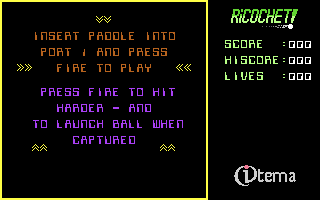
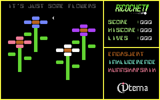

# Ricochet

This game requires a paddle to play. When using the VICE emulator, add the following to the command line in order to use the mouse as a paddle in port 1: `-mouse -controlport1device 2`. On macOS use ⌘M to toggle mouse grabbing.

## Screenshots

## Useful resources

* [Codebase64](https://codebase64.org/doku.php?id=start)
* [Dustlayer](https://dustlayer.com)
* [Kick Assembler User Guide](http://www.theweb.dk/KickAssembler/webhelp/content/cpt_Introduction.html)
