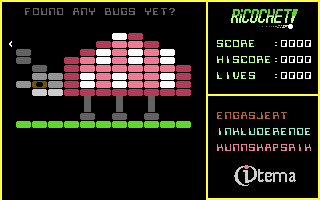

# Ricochet

This game requires a paddle to play. When using the VICE emulator, add the following to the command line in order to use the mouse as a paddle in port 1: `-mouse -controlport1device 2`. On macOS use ⌘M to toggle mouse grabbing.

## How to Play

- Keep the ball in play by sliding the paddle left and right; the standard fire button is your only action.
- Chip away at the bricks to earn points. Clear every brick to advance to the next level.
- Watch the screen border: when it turns cyan the paddle is holding the ball. Reposition, tap fire to relaunch, or let the ball settle onto the paddle to recapture it.
- Need more punch? Hold the fire button until the paddle flashes cyan, then release to drive the ball with boosted speed.

Stay alert—the pace ramps up, and losing the ball costs a life.

## Screenshots

Yes, there are more levels :) …

## Useful resources

* [Commodore Commander](https://github.com/turesheim/commodore-commander) – The Eclipse Platform based IDE used to develop this game.
* [Kick Assembler User Guide](http://www.theweb.dk/KickAssembler/webhelp/content/cpt_Introduction.html) – Commodore Commander has a built in compiler. This is the one.
* [Commodore 64 fonts](https://github.com/patrickmollohan/c64-fonts?tab=readme-ov-file) – A bunch of nice fonts for the Commodore 64.
* [PETSCII Editor](https://petscii.krissz.hu/) – An awesome web based tool used to design the character set and all the levels for this game.
* [Convertrol 3000](https://github.com/fieserWolF/convertron3000) is a graphics converter for Commodore 64 computers. It runs on 64 bit versions of Linux, MacOS, Windows and other systems supported by Python.
* [Commdore 64 Title Screens](https://c64screenshots.com/titles/) A nice collection of title screens for inspiration

---
* https://www.sca.ch/c64/software/graphics/Koalapainter/
* 
