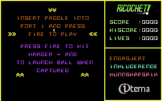
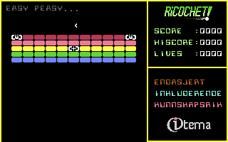
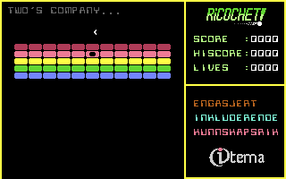

# Ricochet

This game requires a paddle to play. When using the VICE emulator, add the following to the command line in order to use the mouse as a paddle in port 1: `-mouse -controlport1device 2`. On macOS use ⌘M to toggle mouse grabbing.

Score points by hitting the bricks thus removing them. When all bricks are removed, the game will continue on to the next level.

When the screen border turns cyan, the ball is captured, you can move the paddle to a suitable position and launch the ball by pressing fire. Capture the ball by letting slow down and rest on the paddle.

If more velocity is required, press the fire button until the paddle turns cyan – and it will hit harder.

## Screenshots

Yes, there are more levels :) …

## Useful resources

* [Commodore Commander](https://github.com/turesheim/commodore-commander) – The Eclipse Platform based IDE used to develop this game.
* [Kick Assembler User Guide](http://www.theweb.dk/KickAssembler/webhelp/content/cpt_Introduction.html) – Commodore Commander has a built in compiler. This is the one.
* [Commodore 64 fonts](https://github.com/patrickmollohan/c64-fonts?tab=readme-ov-file) – A bunch of nice fonts for the Commodore 64.
* [PETSCII Editor](https://petscii.krissz.hu/) – An awesome web based tool used to design the character set and all the levels for this game.

